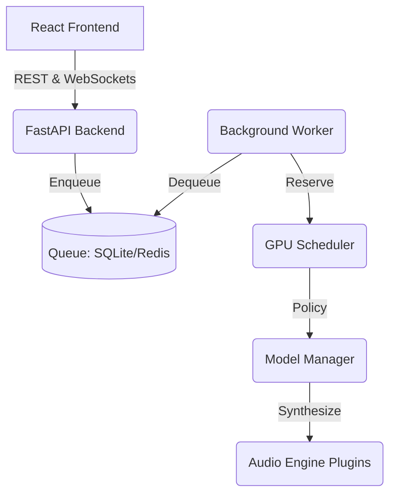

# Voice Studio 🎙️

Voice Studio is a production-grade, open-source AI platform for asynchronous voice cloning and text-to-speech synthesis. Built for multi-GPU scalability on hardware like the DGX, it features a modular plugin architecture, dynamic GPU scheduling, and a modern React frontend.

## Key Features

- **Multi-GPU Scheduling**: Dynamically routes inference jobs using configurable policies (e.g., Least VRAM Used, Model Affinity) via a custom GPUScheduler.
- **Asynchronous Architecture**: REST API decoupled from background worker threads via a robust Queue abstraction.
- **Plugin Architecture**: Easily integrate any TTS engine (F5-TTS, XTTS, etc.) by implementing the `BaseAudioEngine` interface.
- **Modern UI**: A responsive, real-time React Dashboard built with Vite, TypeScript, and Zustand. Real-time updates powered by WebSockets.
- **Observability Built-In**: Prometheus metrics, Grafana dashboards, and structured JSON logs out of the box.

## Architecture Overview



## Quick Start (Docker Compose)

Voice Studio provides a fully orchestrated Docker Compose setup.

```bash
git clone https://github.com/your-org/voice-studio.git
cd voice-studio

# Start the stack (API, Worker, Frontend, Prometheus, Grafana)
docker compose up --build
```

- **Frontend**: http://localhost:80
- **API Docs**: http://localhost:8000/docs
- **Grafana**: http://localhost:3000 (admin/admin)
- **Prometheus**: http://localhost:9090

## Benchmarks (DGX Server)

Initial performance testing of the multi-GPU scheduling layer.

| GPUs | Concurrent Jobs | Throughput (sec of audio / sec) | Avg Latency |
| ---: | --------------: | ------------------------------: | ----------: |
|    1 |               1 |                          [TBD] |       [TBD] |
|    2 |               4 |                          [TBD] |       [TBD] |
|    4 |               8 |                          [TBD] |       [TBD] |

## Documentation

- [API Reference](docs/api.md)
- [Plugin Development Guide](docs/plugins.md)
- [Contributing](CONTRIBUTING.md)

## Roadmap

- **v1.0.0**: Public Open Source Release (Docker + CI/CD + Observability) 🚀
- **v1.1.0**: OpenTelemetry Distributed Tracing & Job Cancellation
- **v1.2.0**: Kubernetes Helm Charts, Horizontal Worker Scaling & Redis Streams
- **v1.3.0**: Authentication, RBAC, Multi-user Quotas
- **v2.0.0**: Multi-node scheduling & Distributed inference
