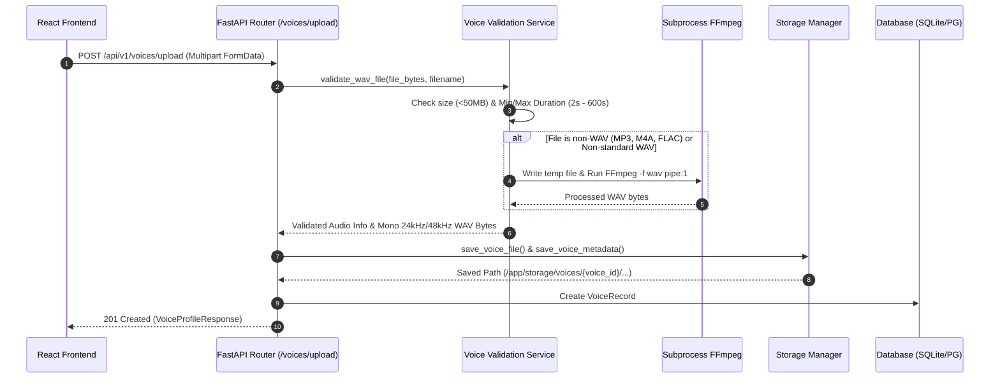
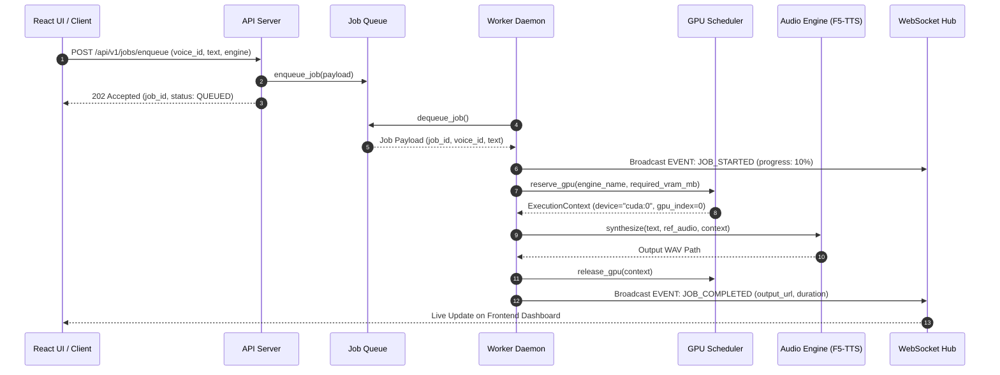

# Voice Studio Architecture & Technical Workflow

This document details the internal architecture, audio pipeline, asynchronous job queue, GPU scheduling policy, and WebSocket streaming mechanism of Voice Studio.

---

## Architecture Diagram

```mermaid
flowchart TD
    subgraph Client Layer
        UI[React Dashboard]
        CLI[Benchmark Suite / External API Client]
    end

    subgraph API & Control Plane (FastAPI)
        Router[API Gateway / Routers]
        Val[Voice Validation Service]
        QueueManager[Queue Manager]
        WSHub[WebSocket Connection Hub]
    end

    subgraph Storage & Persistence
        DB[(SQLite / PostgreSQL)]
        DiskStorage[/Local Audio & Metadata Storage/]
        RedisQueue[(Redis Queue - Production)]
    end

    subgraph Execution & Worker Plane
        Daemon[Background Worker Daemon]
        Scheduler[Multi-GPU Scheduler]
        EngineRegistry[Plugin Engine Registry]
        F5TTS[F5-TTS Plugin]
        MockEng[Mock Plugin]
    end

    UI -->|REST Upload & Job Trigger| Router
    UI <-->|Real-time Events| WSHub
    CLI -->|Enqueue Benchmark Jobs| Router

    Router -->|1. Validate Audio & FFmpeg Normalization| Val
    Val -->|Save .wav & metadata| DiskStorage
    Router -->|2. Store Record| DB
    Router -->|3. Enqueue Job Payload| QueueManager

    QueueManager -->|Push Job| RedisQueue
    Daemon -->|Poll / Dequeue Job| QueueManager

    Daemon -->|4. Request GPU Context| Scheduler
    Scheduler -->|Policy: Least VRAM / Model Affinity| Scheduler
    Daemon -->|5. Execute Synthesis| EngineRegistry

    EngineRegistry --> F5TTS
    EngineRegistry --> MockEng

    Daemon -->|6. Save Audio & Update Job Status| DB
    Daemon -->|7. Broadcast Progress| WSHub
    WSHub -->|WebSocket Push| UI
```

---

## Detailed System Workflows

### 1. Reference Voice Upload & Audio Normalization Workflow



1. **Validation & Size Checks**: Accepts `.wav`, `.mp3`, `.m4a`, `.flac` up to 50MB.
2. **FFmpeg Normalization**: Converts non-WAV or incompatible sample-rate files in-memory (or using seekable temp files for container formats like M4A) to mono 24kHz/48kHz WAV audio.
3. **Metadata Indexing**: Extracts sample rate, channels, bit depth, and exact duration before saving `voice.json` and persisting the database record.

---

## 2. Asynchronous Audio Generation & GPU Scheduling Workflow



1. **Job Enqueue**: Non-blocking `202 Accepted` response returning `job_id`.
2. **Worker Dequeue**: Background daemon picks up job from queue (SQLite fallback or Redis Streams).
3. **Multi-GPU Allocation**:
   - `Least VRAM Used`: Assigns job to GPU with maximum free memory.
   - `Model Affinity`: Assigns job to GPU already holding model weights in VRAM to minimize cold-start latency.
4. **WebSocket Push**: Pushes real-time progress events (`JOB_STARTED`, `JOB_PROCESSING`, `JOB_COMPLETED`, `JOB_FAILED`) over WebSockets (`/api/v1/ws`).

---

## 3. Multi-GPU Scheduling Policies

| Policy | Description | Ideal Use Case |
| :--- | :--- | :--- |
| **`least_vram_used`** (Default) | Routes job to GPU with highest available free memory. | High-concurrency heterogeneous loads |
| **`round_robin`** | Alternates sequential jobs across available CUDA devices. | Homogeneous predictable workloads |
| **`model_affinity`** | Prefers GPUs that already cached the requested engine weights. | Zero-shot engine switching optimization |

---

## 4. Operational Telemetry & Monitoring

- **Prometheus Metrics** (`/metrics`):
  - `voicestudio_jobs_total{status="completed|failed"}`
  - `voicestudio_job_duration_seconds`
  - `voicestudio_gpu_vram_used_bytes{gpu_id="0"}`
- **Structured JSON Logging**: All logs include `X-Request-ID` tracing across API and background workers.
